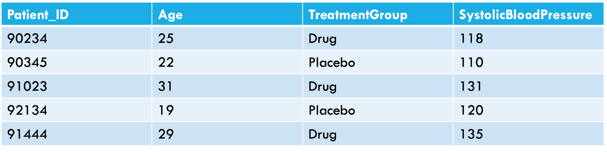
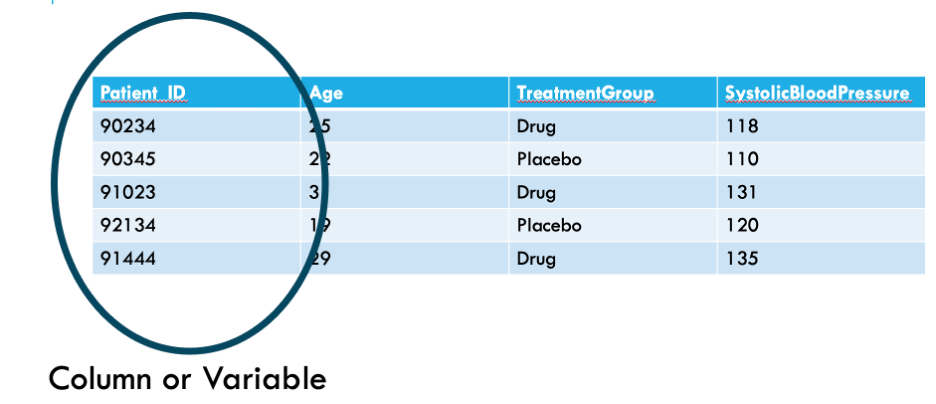
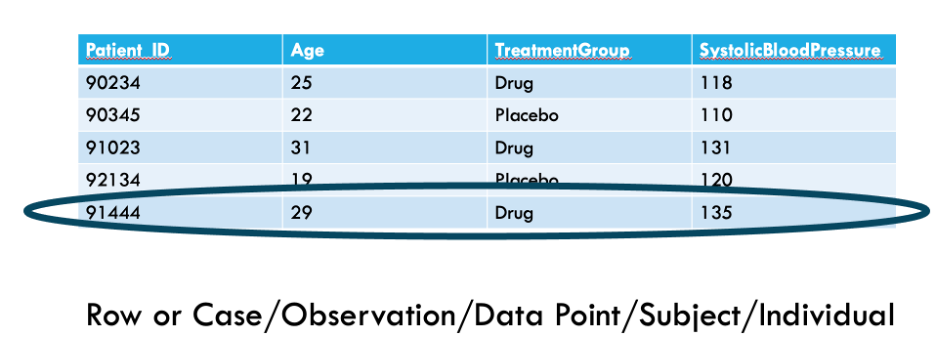
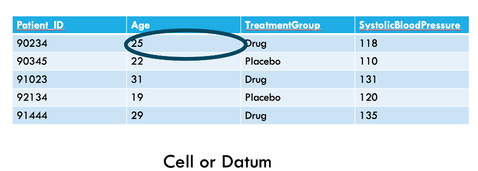
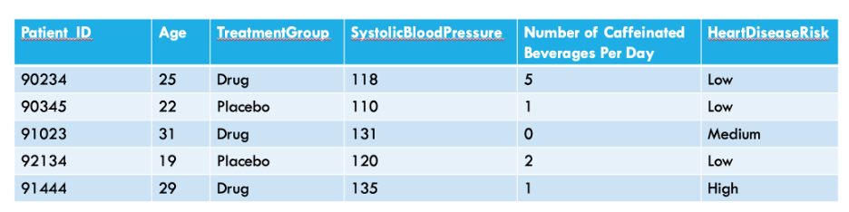
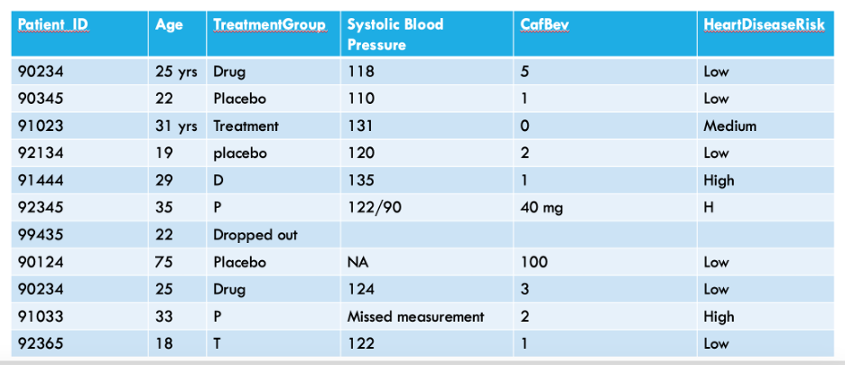

```{r setup, include=FALSE}
knitr::opts_chunk$set(echo = T)
```

## Installing Git and sending your username
 - Listed in the assignments is the pre-homework for class on Thursday
 - Please turn in your GitHub name by Wednesday at 11:59 PM. 
    + There is a text entry box to do this under the "assignments" tab. (You don't need to send me an email or a canvas message.)
 - Here is a link: http://happygitwithr.com/install-git.html#install-git
 - Please follow instructions to get started with git. 
 - Try to install git in the most scientific way possible - if one way doesn't work, try the next, and google your mistakes! 
 
## Annotated Bibliography Reminder
- Bibliography is due Feb 13th


      
## Goals for today

- Identify data types
- Identify parts of a data sheet
- Enter data into a data sheet following data entry best practices
- Interpret variable definitions and metadata
- Learn tools for cleaning and managing data in R

## Improve data management through:

- Building pipelines
- Datasheet format
- File management
- Maintaining relational structure between data types
- Meta-data tracking

## What are data?

Data are a collection of discrete or continuous values that convey information, describing the quantity, quality, fact, statistics, other basic units of meaning, or simply sequences of symbols that may be further interpreted formally.

## Different types of data

- Categorical
- Quantitative
- Discrete (a mixture of the two)

## Different types of data

- Categorical
  - e.g. Major, County, Year in College

- Quantitative
  - Continuous
    - e.g. temperature

- Discrete
    - e.g. Yes/No (coin flip)

## Anatomy of a datasheet

```{r, out.width = "800px",echo=F}

```

## Anatomy of a datasheet

```{r, out.width = "800px",echo=F}

```

## Anatomy of a datasheet

```{r, out.width = "800px",echo=F}

```

## Anatomy of a datasheet

```{r, out.width = "800px",echo=F}

```

## Anatomy of a datasheet

 What types are data are listed?

```{r, out.width = "800px",echo=F}

```
 
## What's wrong with this datasheet?


```{r, out.width = "800px",echo=F}

```

## Data entry best practices
- Variable names should be short but descriptive
  - We want to know what each variable is, but we also need to type variable names often when coding

## Data entry best practices
- There should only be one piece of data per cell
  - Each variable should have its own column
  - Each piece of information about a case should be in its own cell
  - This will allow us to analyze data cleanly

## Data entry best practices
- Do not encode information using formatting
  - All information should have its own column
  - Coloring cells or bolding text can be useful when making spreadsheets but will be lost when read into an analysis software

## Data entry consistency
- Use consistent labels for categorical data
  - Computers will treat differences in spelling, abbreviation, or capitalization as different categories

## Things R thinks are different, but might seem the same to you
- Maple
- maple
- MAPLE
- "Maple_"
- " maple"
- malpe
- mapel

## Documentation

- Describes how the data were collected

- What we can expect to find in the datasets

- This is often described in a README

## *Metadata* and data dictionaries | *preserving tangential information*

How do you store data that is important but not specific to a single 'observation'?

- e.g. blood pressure units, instruments that took temperature measurements
- Create a separate metadata file that includes the same variables as observational data (e.g., blood pressure, temperature)

## Metadata and *data dictionaries* | *preserving tangential information*

How would someone stepping into the project understand the data you collect?

- We often collect data that isn't intuitive to everyone (me: wing score, RFA, etc)

- ***Make a data dictionary***: 
    - A table of definitions in an Excel spreadsheet (or other program)
    - Each variable from the datasheet is described thoroughly, including precisely what it measures
    
## Pipelines

Pipelines are ways of carefully recording and systematizing the steps you take to work with your data

### Ideally your project will depend on: {.smaller}

- Some data files: spreadsheets storing data (.csv files from Excel)
- Some scripts (more on this later)
- Something that tells you how these things go together: README file

## Record keeping | *long-term pipeline success*

### You will inevitably forget your procedure.
- Write a protocol for how your files are organized/linked together
- Track any modifications using your README file or other notebook. 
- ***Advantages***:
    - Allows more flexibility and time saving if you need someone to help
    - Provides an easy reference for yourself
    - Reminds you how you set up your pipeline if you need to be away from the project for any time

## Now, data is collected, entered to spreadsheets, and filed appropriately!
Now you are ready to work with your data in R!

## Break 
- download file le4_data_manipulation.R
- open the file in R studio
- make sure you can read in batdat.csv 
  - note: if you have done this, ask your neighbor if they need help

## Read in your data
__read.csv()__ is the function to use when reading your spreadsheets into R. 

Using .csv files to store and read-in your data is important!

* Stores data in a text format (human-readable; transferrable)
* Can store large amounts of data in simple format
* Can be read by most programs

## You can read in batdat, each row is a bat

```{r batdat, echo=TRUE}
# in this dataset, each row is a bat that 
# is positive or negative for P. destructans
batdat=read.csv("/Users/klangwig/Desktop/VT/teaching/quant grad course/github/klangwig/bat_data.csv")
head(batdat)  
```


##  Getting Started with Data
- Save files as .csv

- IMPORTANT – saving an excel file as a CSV means that you will lose some data
+ For example, if you used excel to calculate a formula, the formula will be gone as R will just store this as plain text
- DON’T USE EXCEL TO DO CALCULATIONS – JUST ADD THIS TO YOUR CODE IN R
- Use smart column names. R can’t handle spaces in your column names, so get rid of those. Also don’t use a bunch of capitals unnecessarily because it slows down your coding. e.g. use “species” not “Species”


## Making your excel file
- Excel files should have a list of column names at the top only and variable values

- A reminder: your excel file should not look like your field data sheet!

## Missing values

When you input data, you need to be aware of `NA` ("not available"). Your
read function has an option called `na.strings` which you can use to
communicate between R and your CSV files, for example. You need to know
that

- use `is.na()` to test for `NA` values, `na.omit()` to drop them, and the optional `na.rm` argument in some functions (`mean`, `sum`, `median` ...)
- in the tidyverse, you can use `drop_na()` to remove `NA`


## Examination

You should think creatively, and early on, about how to check your data.
Is it internally consistent? Are there extreme outliers? Are there
typos? Are there certain values that really mean something else?

An American Airlines memo about fuel reporting from the 1980s complained of multiple cases of:

-   Reported departure fuel greater than aircraft capacity
-   Reported departure fuel less than minimum required for trip
-   Reported arrival fuel greater than reported departure fuel


You should think about what you can test, and what you can fix if it's
broken.

## Things to fix in excel
- naming inconsistencies (see maple example)
- column name issues (spaces)
- use excel's find and replace and filter function to find these


## Tidy(ing) data

Hadley Wickham has defined a concept of [tidy
data](http://www.jstatsoft.org/v59/i10/paper), and has
introduced the `tidyverse` package.

-   Each variable is in a column
-   Each observation is in a row
-   "Long" rather than "wide" form
-   Sometimes duplicates data
-   Statistical modeling tools and graphical tools (especially the
    **ggplot2** package) in R work best with long form
    
## An example of tidy data
```{r, out.width = "800px",echo=F}
knitr::include_graphics("tidy_pic.png")
```

## Learning about the tidyverse
- https://www.tidyverse.org

## Piping
- tidyverse syntax is VERY different from base R
- it relies on using `%>%`
- this is called a pipe
- it says the word "then"

## Critical tools for managing data in tidyverse

- `pivot_longer`, `pivot_wider`
- `mutate`: add a column
- `select`: select columns
- `filter`: select rows
- `group_by`: group then do something (usually mutate or summarise)
- `summarise`: make a summary table
- `arrange`: sort
- `bind_rows`: combines dataframes by stacking them on top of each other - keeps all columns; will make duplicates if the columns don't match (e.g 'species', 'Species')
- `left_join`: merge [see other `join` options](https://dplyr.tidyverse.org/reference/mutate-joins.html)

## First load the package
```{r load_tidyverse}
library(tidyverse)
```

## Group by
 - `group_by` is my favorite tidyverse command which has cut my need to write loops in half
 - `group_by` allows you to do calculations on groups of things, for example, by species or year
- `group_by` is kind of like using Excel's `filter`
- For example, if I group_by `species, date`, this is the equivalent in Excel of selecting a species (e.g. MYLU) and a specific date (e.g. March 1 2016, 3/1/16) except group_by does this for every species and date combination in your dataset
- This is incredibly useful because in other programs, you might need to write a for loop to have this capability

## Group by species
```{r group_by_example}
batdat$lgdL = log10(batdat$gdL)
batdat %>% 
  group_by(species) %>% 
    summarise(mean.fungal.loads=mean(lgdL,na.rm=TRUE))
```

## Summarise versus Mutate
 - `summarise` creates a new dataframe 
 - `mutate` does a calculation where it add a new column to your existing dataframe
 
## Importance of assigning 
```{r}
fungal.load.table = batdat %>% 
  group_by(species) %>% 
  summarise(mean.fungal.loads=mean(lgdL,na.rm=TRUE))

fungal.load.table

```

## Assigning
- When using summarise, it's best to call your summarised object a new name (e.g. fungal.load.table)
- This is typically not necessary when using mutate which just adds a column to an existing dataset
 
```{r mutate example}
batdat = batdat %>% 
  #take batdat, then group by somethings
  #we re-assign batdat to batdat because we want to add the column to that dataframe
    group_by(site,species,date) %>% 
  #you can group_by multiple things
    mutate(sample.size=n())
#this adds a column to the dataframe 
#using the function n(), which counts things (e.g n rows in the group)
```

## What does our dataframe look like now?
```{r looking at new dataframe}
head(batdat %>%
       select(c("swab_id", "site","species","date","gd","sample.size")))
#this is just showing a few columns for effect
```

## Joining
- Joining datasets together is a useful skill, especially if we have two datasets we need to match on a specific column or set of columns
- https://dplyr.tidyverse.org/reference/mutate-joins.html
- Always call your new dataframe something new; don't write over and old dataframe in case you make a mistake joining

## Join functions
- `inner_join()`: includes all rows in x and y.
- when inner joining, non-matching rows will be dropped!
- `left_join()`: includes all rows in x.
- when left joining, every row in x is kept, but only those matching x are kept in y
- `right_join()`: includes all rows in y.
- when right joining, every row in y is kept, but only those matching y are kept in x
- `full_join()`: includes all rows in x or y.
- every row is kept in both x and y

## Joining actual datasets
- We frequently have data coming from different sources (lab, field, etc.)
- Let's join our infection data with our count data
- We might want to do this to ask 'How does the count of one species influence another infection in that species?'
- A note - a previous merge I did added this to your data but let's pretend it isn't there...


## Example with bat count data
- We are making a dataset here using aggregate but imagine this came from a different file
```{r remove_unique.id, echo=T}
batcount<-aggregate(count~species+site+date,data=batdat, FUN=mean) 
head(batcount)
```

## Join batdat and batcount
```{r}
batdat_count = left_join(
  x = batdat,
  y = batcount,
  by = c("site","species","date")
  #columns to join on
)
head(batdat_count %>%
       select(c("swab_id","site","date","species","count.y")))
```

## Pivoting
- https://tidyr.tidyverse.org/articles/pivot.html
- sometimes our datasets are not in the format we want for an analysis

## Why pivot?
```{r}
head(batdat_count)
# right now, species is in long format
# but we could imagine wanting to test the abundance of one species 
# and how that influences another
# for example, does the number of MYLU influence the number of MYSE?
# for that, we would need to make columns of each species count
# with a row for a site and a date

```


## `pivot_wider` is how we take long data, and make it wide
```{r}
batcounts.wide<- batcount %>% 
  #this says - make a new df called batcounts.wide using bat counts
  pivot_wider(names_from = species, 
              values_from = count
              ) 
##make columns for each of the values in the species column and fill those columns with values from the count column
head(batcounts.wide)
```


## adding 0s into a `pivot`
- when we perform this, it automatically fills missing with NAs but we know that missing actually mean 0
```{r}
batcounts.wide = batcount %>% 
  pivot_wider(
  names_from = species, 
  values_from = count,
  values_fill = 0
)
head(batcounts.wide)
```

## Going from wide to long format
- more often, we might be working in the opposite direction
- A more common issue is that programs output  information in columns that we would rather have in rows

```{r}

batcounts.long = batcounts.wide %>% 
  pivot_longer(
    cols = c("EPFU","MYLU","MYSE","PESU"), 
    #what are the existing columns I want to make into rows?
    names_to =   "species",
    #put the names of the columns in a column called 'species'
    values_to = "count"
    #the values that were in each of the columns get moved to a column called 'count'
  )
```

## Check out new batcounts.long
```{r}
head(batcounts.long)

```


## So how do we create tidy datasets?
 - Make your data as tidy as possible
 - Learn to manipulate data in R and hardcode these changes into your scripts
 - There is no perfect method - each dataset is unique
 - Manipulating data in R is hard, sometimes harder than excel. But learning to do it SO worth it because you will save hours of time for each project you do. 

