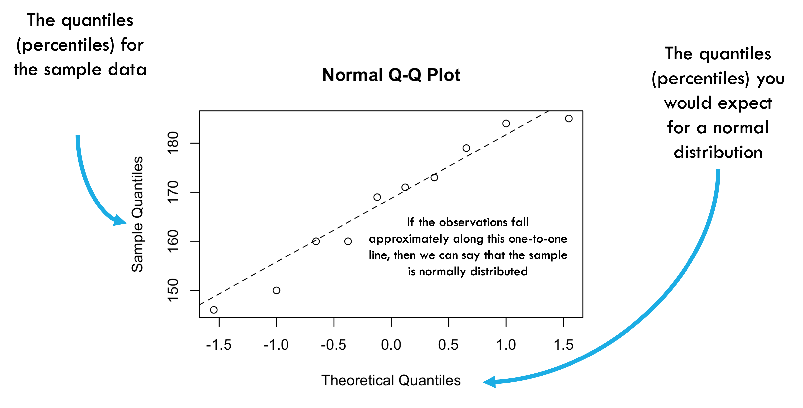
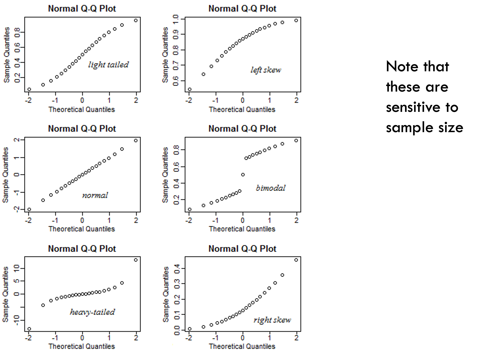
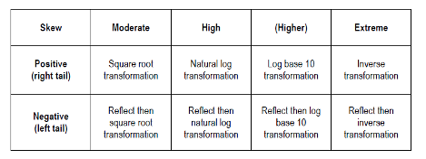

# Introduction

## Goals for today

-   Introduce linear regression
-   Learn how to interpret model output
-   Understand diagnostic plots
-   Learn about transformations

## History

-   ANOVA, ANCOVA, regression, $t$ test are all variations of the same
    animal, the *general* linear model
-   Many people (including the R project) call it a linear model (`lm`)
    to distinguish it from the *generalized* linear model (`glm`)
-   these models are typical fit by ordinary least squares


## Extended linear models

-   *Generalized* linear models can incorporate:
    -   (Some) non-linear relationships
    -   Non-normal response *families* (binomial, Poisson, ...)
-   *Mixed* models incorporate *random effects*
    -   Categories in data represent samples from a population
    -   e.g. species, sites, genes ...
    -   Traditionally used to account for experimental blocks

# Basic theory

## Assumptions

-   *Response variables* are linear functions of *input variables*, in
    turn based on *predictor variables*
    -   Can have one or more input variables per predictor variable
    -   Each input variable is associated with an estimated parameter
        (more about this later)
-   *Errors* or *residuals* are Normally distributed
    -   In other words, the difference between our model *predictions*
        and our observations is Normal
    -   *not* assuming the marginal distribution is Normal (e.g. a
        histogram of an input variable)
    -   (Go to board/paper for residual drawing)
-   Predictor variables are independent

## Machinery

-   *least squares* fit - we get parameters that minimize the squared
    differences between predictions and observations
-   Least squares fits have a lot of nice properties
-   Sensitive to some departures from the assumptions
    -   anomalous events tend to have a larger effect than they should

## One-parameter variables - continuous

-   Continuous predictor variable: estimate a straight line with one
    parameter
    -   Also implies one *input variable*
-   $Y = a+bX$
-   $Y$ is the response\
-   $X$ is the input variable\
-   $b$ is the *slope* and the expected change in Y per unit change in X

## One-parameter variables - categorical

-   Categorical predictor variable with two categories: only one
    parameter
    -   difference in predicted value between levels
-   Parameters are (usually) easy to interpret

## You can read in batdat, each row is a bat

```{r batdat, echo=TRUE}
# in this dataset, each row is a bat that 
# is positive or negative for P. destructans
batdat=read.csv("bat_data.csv")
head(batdat)  
```

## Some transformations (discussed more later)

```{r}
batdat$lgdL = log10(batdat$gdL)
batdat$lcount = log10(batdat$count)
```

## Running a linear model in R - continuous predictor {.smaller}

```{r}
mod1 = lm(lgdL~lcount, data = batdat)
summary(mod1)
```


## Interpreting model output in R - continuous predictor {.smaller}
-   y = ax + b / lgdL = -0.7043x + (-1.6718)
-   First line - intercept (-1.6718), P-value: probability value is >0

-   Second lines: labeled with parameter names
    -   Predictor is *continuous* so value is slope (-0.704) (or coef)
    -   The value represents the change in the predicted value of the y
        for each one-unit increase in the x variable (holding all other
        variables constant)
    -   p-value: when *continuous*, the probability of observing a
        coefficient as extreme as the one calculated if the true
        coefficient were actually zero (the null hypothesis)
    -   in plain language: whether your x variable has a significant
        effect on your y
    -   Std. Error: An estimate of the uncertainty of the coef.
        estimate.

## Running a linear model in R - categorical predictor {.smaller}

```{r, lm}
mod2 = lm(lgdL~species, data = batdat)
summary(mod2)
```

## Interpreting categorical data is trickier

-   First line (labeled INTERCEPT) is actually the REFERENCE
-   This is the omitted group; (EPFU) in this case
-   Each other parameter listed is in REFERENCE to the estimated value
    of the this variable!
-   e.g. speciesMYLU is saying that MYLU have, on average, 0.61607 more
    fungus than EPFU
-   you can manually change the reference level of the variables or use
    other packages to change these contrasts (more on this next week)

## Diagnostics

-   Because the linear model is sensitive (sometimes!) to assumptions,
    it is good to evaluate them
-   Concerns:
    -   *Heteroscedasticity* (does variance change across the data set,
        check diagnostic plots)
    -   Linearity (does your model fit well?)
    -   Normality (assuming no overall problems, do your **residuals**
        look Normal?)
    -   Independence (no autocorrelation)
        -   current value is independent of the previous (historic)
            values - important for time series data
-   Normality is the **least important** of these assumptions

## First visualize residuals
```{r}
hist(resid(mod1))
```
- Doesn't look terrible, but can we be certain?


## Using qq plots
```{r, out.width = "800px",echo=F}

```

## Solving issues
```{r, out.width = "800px",echo=F}

```

## Basic diagnostic plots in R
- use code 'plot(mod1)' to generate 4 diagnostic plots
```{r}
par(mfrow=c(2,2))  # set 2 rows and 2 column plot layout
plot(mod1)
```

## Default plots in R - Heteroscedasticity

-   The plots on the left look at variance across the range of fitted
    values
-   They ask - as variable one increases, is it's explanatory ability
    similar across all values? These plots should be flat. Points should
    be randomly scattered.

```{r, echo=FALSE}
par(mfrow=c(2,2))  # set 2 rows and 2 column plot layout
plot(mod1)
```

## Default plots in R - Normality of Residuals

-   The plot on the top right is a qq plot. 
- It examines normality of residuals - this line should be 1:1. 

```{r, echo=FALSE}
par(mfrow=c(2,2))  # set 2 rows and 2 column plot layout
plot(mod1)
```

## Default plots in R - leverage of points

-   The plot on the bottom right examines which points have the greatest
    influence on the regression. I do not recommend removing "real"
    outlier points but you should examine you results with and without
    them to see how much they influence your inference.

```{r, echo=FALSE}
par(mfrow=c(2,2))  # set 2 rows and 2 column plot layout
plot(mod1)
```

## Using the performance package

-   The performance package is a useful package for doing model checks
    and improves on some of the plots in base R
-   You can read more about it here:
-   <https://easystats.github.io/performance/>
-   <https://easystats.github.io/see/articles/performance.html>

## Basic model diagnostic plots with `performance`

-   first you will need to install the package and run it

```{r}
#install.packages(performance)

#load performance
library(performance)

```

## Diagnostic plots using check_model in the performance package {.smaller}

```{r, fig.width=9, fig.height=5}
check_model(mod1)
```

## Diagnostic plots using check_model - linearity {.smaller}

```{r, fig.width=9, fig.height=5}
check_model(mod1,  check = "linearity")
```


## Diagnostic plots using check_model - homogeneity {.smaller}

```{r, fig.width=9, fig.height=5}
check_model(mod1,  check = "homogeneity")
```


## Diagnostic plots using check_model - homogeneity {.smaller}

```{r, fig.width=9, fig.height=5}
check_model(mod1,  check = "outliers")
```

## Diagnostic plots using check_model - normality of residuals {.smaller}

```{r, fig.width=9, fig.height=5}
check_model(mod1,  check = "qq")
```

## What do these tell you?

-   The output is similar to base R but the annotation is better!
-   Posterior predictive checks (Bayesian) can be used to "look for
    systematic discrepancies between real and simulated data by seeing
    whether simulating the regression coefs result in lines that look
    like our data
- Posterior Predictive Check: The predicted data (blue) should roughly match the observed data (black line).
- Linearity: The green line should be flat and horizontal.
- Homoscedasticity: Points should be evenly spread, not forming a funnel shape.
- Q-Q Plot: Residuals should fall along the diagonal dashed line. 

## Some other assumptions

-   the number of datapoints is greater than the number of predictors
-   there is some variability in the values of your predictor (e.g. x is
    not the same)
-   your predictors aren't perfectly correlated (e.g. multicollinearity)


## Transformations

-   One way to deal with problems in model assumptions is by
    transforming one or more of your variables
-   Transformations are not cheating: a transformed scale may be as
    natural (or more natural) a way to think about your data as your
    original scale
-   The linear scale (no transformation) often has direct meaning, if
    you are adding things up or scaling them (as in our ant example)
-   The log scale is often the best scale for thinking about physical
    quantities: 1:10 as 10:?

## A variety of transformations exist to normalize skewed data

```{r, out.width = "800px",echo=F}

```
- reflect: subtract a variable from it's maximum value
  - xnew = (max.value + 1 ) - xold
  
- Light and heavy tailed data: subtract from the median, and then transform

## Transformation tradeoffs

-   A transformation may help you meet model assumptions
    -   Homoscedasticity
    -   Linearity
    -   Normality
-   But there is no guarantee that you can fix them all
-   Piles of zeros are hard too (consider GLMs)

## Transformations FAQs
- Usually we are talking about transforming the Y variable, but transforming the X can also improve model fit
-   Avoid classical 'transform then linear model' recommendations for
    -   probability data or count data
    -   Generally better to respect the structure of these data with a
        GLM

# Tools for fitting and inference

## Basic tools

-   `lm` fits a linear model
-   `summary` prints statistics associated with the *parameters* that
    were fitted

## Plotting

-   `plot` can be applied to an `lm` object to give you a nice set of
    diagnostic tests.
-   `predict` can give predicted values, and standard errors.
-   In `ggplot`, `geom_smooth(method="lm")` fits a linear model to each
    group of data (i.e. each group that you have identified by plotting
    it in a different colour, within a different facet, etc.


## Assignment - Thursday

-   Make a univariate linear model for one of your hypotheses
-   Examine the assumptions of linearity (using diagnostic plots)
-   Explain what these are telling you (it's okay if they aren't normal,
    but tell me why)
-   Plot the relationship in ggplot using stat_smooth or stat_summary

